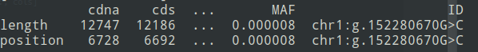

## **Programming test**

**Author:** Muller Coralie
**Language:** Python3

* * *

## Objectif:

Create a program in order to obtain a table of rare/novel high-impact variants only from a list of genomic variants.

* * *

## Installation

* * *

Download the code from the project's repository and run it from a terminal:

`>git clone https://github.com/Kisekya/Project_Phd_variant.git`

* * *
## Language and packages requirements:

* * *

*Packages :*
You need to intall some packages to run the program:

`import sys` 

`import argparse`

`import requests`

`from requests import ReadTimeout, ConnectTimeout, HTTPError, Timeout, ConnectionError`

`import json`

`import pandas as pd`

`from pandas import DataFrame`

`import csv`

* * *

## How to run the program

To run the program, you need to do a command line in the terminal.

Be careful to be in the right path for run your code.

You need some also parameters to determine what you want in your table!

For some help in order to know parameters you need, you do:

`python3 variant.py -h`

After this you can run the programm with this command for exemple:

`python3 variant.py Variants.txt HIGH output.csv`

Normaly, you will have a print of the table in the terminal and obtain this:

You have also an output in csv file with the ann, the ID of your variant and the MAF.

If the MAF doesn't exist the variant have "NA"

If you want to show different steps of your selection you have some `print` in the code in order to show you in the terminal each data.

***

### Improvements

-Headers are missing on the csv file.

-With the ID add a columns for each elements

